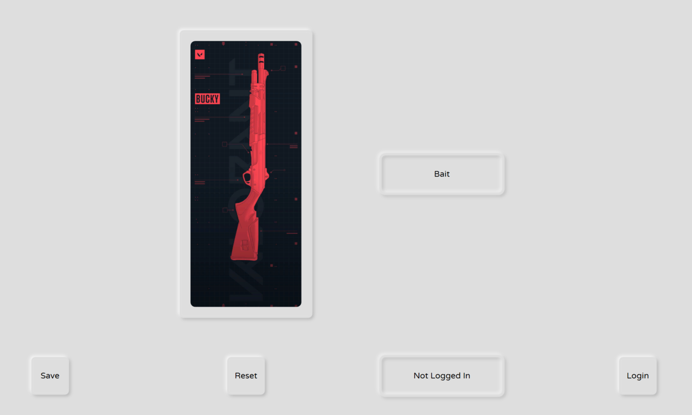

# Valorant Card and Title Changer- Formally Valorant Buddy Manager (Cancelled)

This was a WPF app that I wanted to make to explot a bug in the Valorant third party API. To make it intersting to me I decided to try out Neumorphic Design which let me to creating custom buttons, etc. I spent too much time on this and looking back, that was probably a good thing as the next day Riot mostly patched most of the bug. I initially wanted to continue it and use it for Cards and Titles which were partially working, but I gave up since I was afraid it would be pached too.

Here's some screenshots of what I ended with:

| Home | Squishy Button |
|:-:|:-:|
| 

 | 

 |